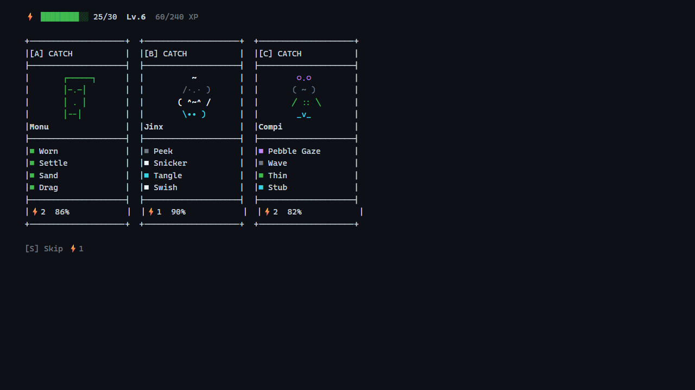
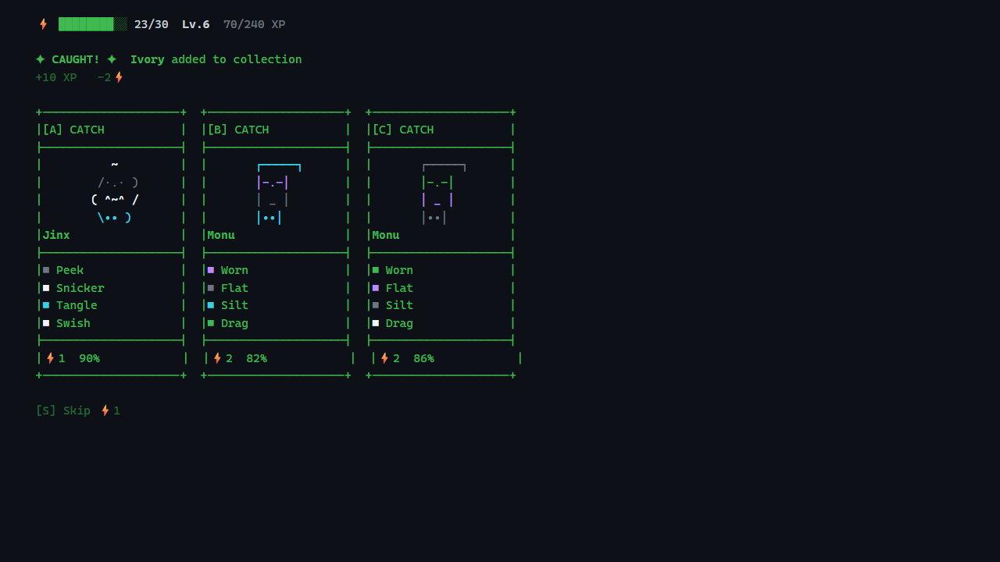
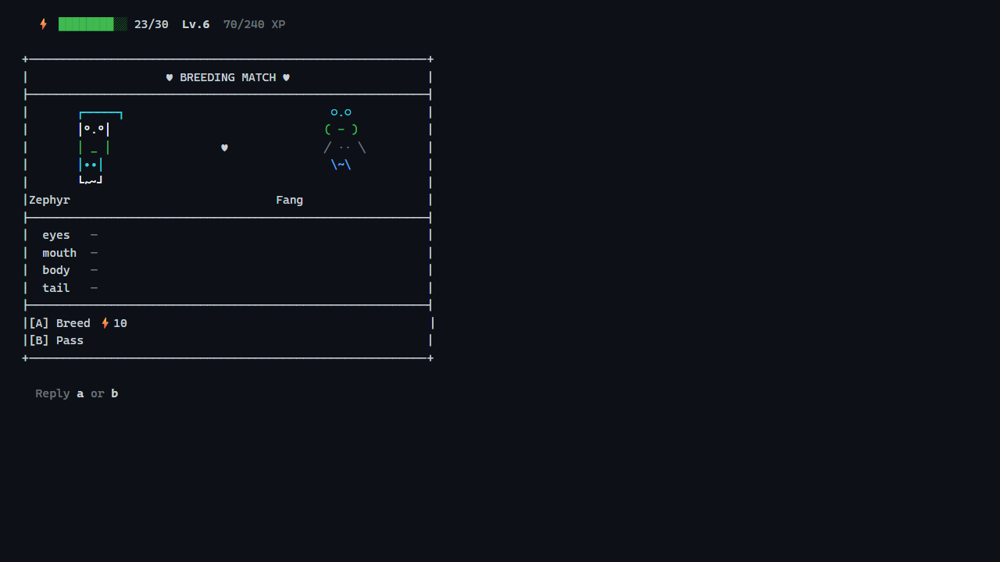
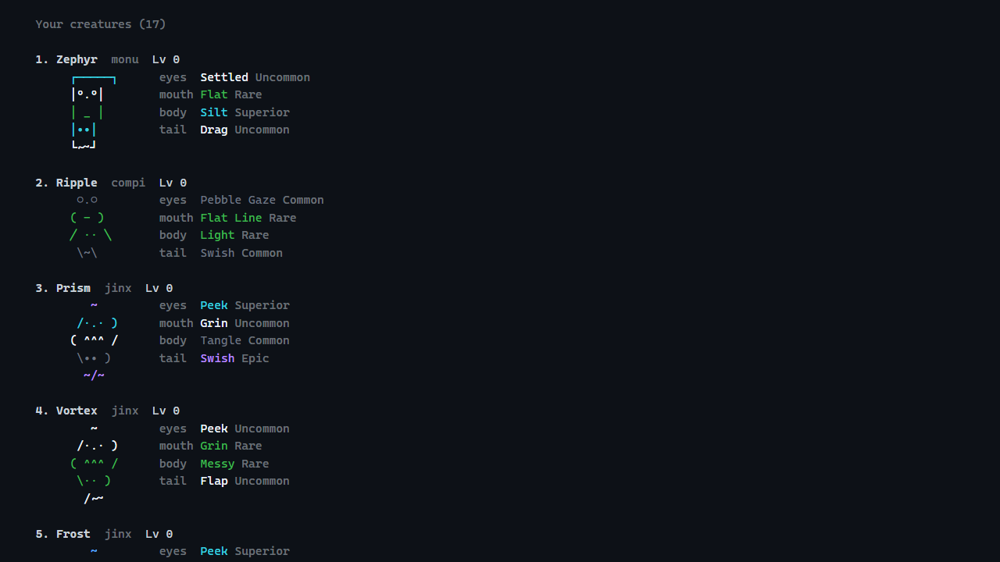

<div align="center">


### Collect creatures while you code — without ever leaving your agent.

Your coding activity spawns unique ASCII creatures with randomized traits across 8 rarity tiers.
One command to play. Pick a card to catch or breed. **Hundreds of millions of possible combinations.**

Works with **Claude Code** | **Cursor** | and more coming soon

[](https://opensource.org/licenses/MIT)
[](https://nodejs.org)

</div>

---

## How It Works

```
1. Code normally        Your prompts, tool calls, and commits generate "ticks"
2. Creatures spawn      Every ~30 minutes a batch of creatures appears nearby
3. Type /play           Draw 3 cards — pick one to catch, skip, or breed
4. Build your crew      Breed pairs to upgrade rarity and discover hybrid species
```

Every creature has **4 trait slots** (eyes, mouth, body, tail), each with its own rarity color — from gray commons to red mythics. Breed matching traits for a chance to upgrade.

## `/play` — One Command, Cards on the Table

Type **`/play`** and the game deals you cards. Pick one. That's it.

<div align="center">


*Three creatures appeared — pick A, B, or C to catch*
</div>

Each card shows the creature's ASCII art, traits with rarity colors, energy cost, and catch rate. Type a letter to choose.

### Catch Result

<div align="center">


*Caught! Next cards are dealt automatically*
</div>

### Breeding

Sometimes you'll draw a breed card — a full-screen matchup between two of your creatures:

<div align="center">


*Matching traits have a chance to upgrade rarity*
</div>

Cross-species breeding creates **hybrid species** with AI-generated names and art.

### Collection

Type **`/collection`** anytime to see your creatures:

<div align="center">

</div>

## Game Systems

- **8 Rarity Tiers** — Common (gray) through Mythic (red). Each trait slot has independent rarity.
- **Energy** — Max 30, regenerates over time. Each turn costs 1 energy. Catches cost 1-5 extra, breeds 3-11.
- **Breeding** — Any two creatures can breed. Same trait = 35% upgrade chance. Cross-species = new hybrid.
- **7 Base Species** — Compi, Flikk, Glich, Jinx, Monu, Pyrax, Whiski. Plus unlimited hybrids.
- **Progression** — XP from catches and breeds. Leveling unlocks higher rarity breeding.

## Installation

### Claude Code

```bash
/plugin marketplace add amit221/compi
/plugin install compi@compi
```

Then enable auto-update:
1. Type `/plugin` to open the plugin manager
2. Go to the **Marketplaces** tab
3. Select **compi**
4. Enable **auto-update**

### Cursor

> Requires **Cursor 2.5 or later**.

```
/add-plugin compi@https://github.com/amit221/compi
```

Then **restart Cursor** and verify under **Settings > Plugins**.

## Commands

| Command | What it does |
|---------|-------------|
| **`/play`** | Draw cards — catch or breed creatures |
| `/collection` | View your creatures (free) |

That's it. Two commands. The game handles the rest.

## Contributing

Compi is open source and contributions are welcome! **[Open an issue](https://github.com/amit221/compi/issues/new)** to start a conversation.

<div align="center">

---

### Enjoying Compi? Help it grow.

[Star the repo](https://github.com/amit221/compi) | [Follow on X](https://x.com/AmitWagner) | [Join r/compiCli](https://reddit.com/r/compiCli)

<sub>Built for the terminal. MIT licensed. No telemetry, no background processes.</sub>

</div>
