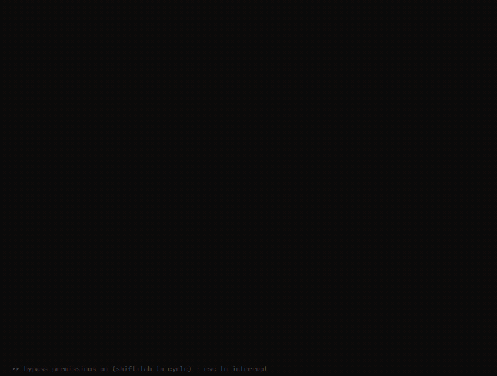
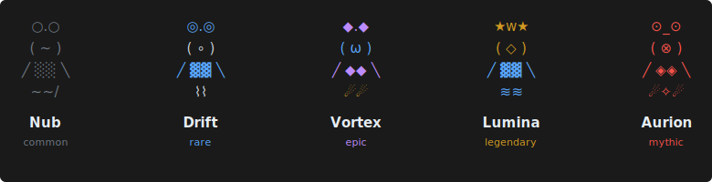

<div align="center">

```
 ██████╗ ██████╗ ███╗   ███╗██████╗ ██╗
██╔════╝██╔═══██╗████╗ ████║██╔══██╗██║
██║     ██║   ██║██╔████╔██║██████╔╝██║
██║     ██║   ██║██║╚██╔╝██║██╔═══╝ ██║
╚██████╗╚██████╔╝██║ ╚═╝ ██║██║     ██║
 ╚═════╝ ╚═════╝ ╚═╝     ╚═╝╚═╝     ╚═╝
```

### Collect creatures while you code — without ever leaving your agent.

Your coding activity spawns unique ASCII creatures with randomized traits across 6 rarity tiers.
Scan to discover them. Catch the ones you want. Merge to upgrade. **15.6 billion possible combinations.**

Works with **Claude Code** | **Cursor** | **Codex** | and more coming soon

[](https://opensource.org/licenses/MIT)
[](https://nodejs.org)
[]()

</div>

---

<div align="center">

</div>

## How It Works

```
1. Code normally        Your prompts, tool calls, and commits generate "ticks"
2. Creatures spawn      Every ~10 ticks, a batch of 3-5 creatures appears nearby
3. Scan & catch         Run /scan to see them, /catch to grab the ones you want
4. Merge & upgrade      Sacrifice one creature to boost another's rarity tier
```

Each creature is built from **4 trait slots** (eyes, mouth, body, tail) with individual rarity and unique ASCII art. Rarer traits glow in different colors — from gray commons to red mythics.

<div align="center">

</div>

## Why Compi?

- **Zero context-switching** — the game lives inside your coding agent, not a separate app
- **Your work fuels the game** — creatures spawn from your actual coding activity
- **Real depth** — 6 rarity tiers, weighted catch rates, merge strategy, streaks, leveling
- **Every creature is unique** — 4 slots x 6 rarities x multiple variants = billions of combos
- **Lightweight** — hooks only, no background processes, no performance impact
- **Open source** — MIT licensed, community-driven

## Installation

```bash
/plugin marketplace add amit221/compi
/plugin install compi@compi
```

Then enable auto-update so you always get the latest version:
1. Type `/plugin` to open the plugin manager
2. Go to the **Marketplaces** tab
3. Select **compi**
4. Enable **auto-update**

## Playing

**Option 1: Dedicated Compi session** (recommended for best experience)

Add this alias to your shell profile (`~/.bashrc`, `~/.zshrc`, or `~/.profile`):

```bash
alias compi='claude --model haiku --verbose --allowedTools "mcp__plugin_compi_compi__*" "Read" "Write" "Edit" "Bash"'
```

**PowerShell** users — add this to your profile (`$PROFILE`):

```powershell
function compi { & claude.cmd --model haiku --verbose --allowedTools "mcp__plugin_compi_compi__*" "Read" "Write" "Edit" "Bash" @args }
```

Then just run:

```bash
compi
```

This launches a lightweight session using Haiku (fast + cheap) with Compi tools, file access, and CLI enabled.

**Option 2: Play alongside your work**

Compi runs in the background of any Claude Code session. Creatures spawn as you work — you'll see notifications and can interact with `/scan`, `/catch`, `/merge` at any time without interrupting your workflow.

## Commands

| Command | CLI | What it does |
|---------|-----|-------------|
| `/scan` | `compi scan` | Show nearby creatures with traits, catch rates, and energy costs |
| `/catch [n]` | `compi catch [n]` | Catch creature #N from the current batch |
| `/merge [a] [b]` | `compi merge [a] [b]` | Sacrifice creature B to upgrade creature A |
| `/collection` | `compi collection` | Browse your caught creatures and their traits |
| `/energy` | `compi energy` | Check your current energy level |
| `/status` | `compi status` | Player profile, stats, and progress |
| `/settings` | `compi settings` | Configure notifications and preferences |

## Rarity Tiers

| Tier | Color | Spawn Rate | Catch Cost | Base Catch Rate |
|------|-------|------------|------------|-----------------|
| Common | Gray | 30% | 1 energy | 80% |
| Uncommon | White | 25% | 1 energy | 75% |
| Rare | Cyan | 20% | 2 energy | 70% |
| Epic | Magenta | 13% | 3 energy | 62% |
| Legendary | Yellow | 8% | 4 energy | 52% |
| Mythic | Red | 4% | 5 energy | 40% |

Each failed catch in a batch adds a 10% penalty to your next attempt — choose wisely.

## Contributing

Compi is open source and contributions are welcome! Whether it's new trait variants, balance tweaks, bug fixes, or platform adapters — open a PR or start a discussion.

```bash
git clone https://github.com/amit221/compi.git
cd compi
npm install
npm test             # 71 tests across 7 suites
npm run build        # TypeScript → dist/
npm run dev          # Watch mode
```

## Development

```bash
npm install          # Install dependencies
npm test             # Run 71 tests across 7 suites
npm run build        # Compile TypeScript → dist/
npm run dev          # Watch mode (tsc --watch)
```

<div align="center">

---

MIT License

If you enjoy Compi, consider giving it a star — it helps others discover it.

</div>
